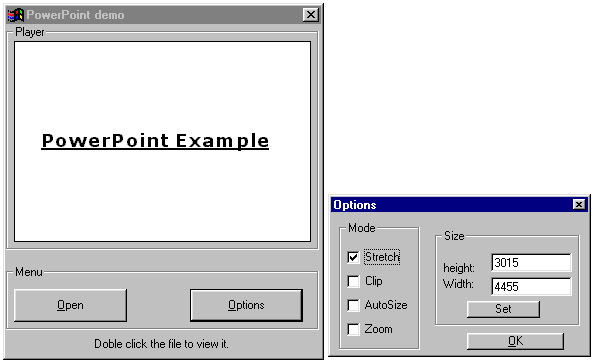



## PowerPoint Viewer

### Description

Hello, this example shows you show to view powerpoint (.ppt) files inside your vb project. You can also change the file and change some viewing options.

Every line is commented. please vote!

Thanks hope this help,

Matt!!
 
### More Info
 

             |
---                |---
**Submitted On**   |2000-10-29 01:25:50
**By**             |[Matthew Woodhams](https://github.com/Planet-Source-Code/PSCIndex/blob/master/ByAuthor/matthew-woodhams.md)
**Level**          |Beginner
**User Rating**    |4.7 (47 globes from 10 users)
**Compatibility**  |VB 6\.0
**Category**       |[Miscellaneous](https://github.com/Planet-Source-Code/PSCIndex/blob/master/ByCategory/miscellaneous__1-1.md)
**World**          |[Visual Basic](https://github.com/Planet-Source-Code/PSCIndex/blob/master/ByWorld/visual-basic.md)
**Archive File**   |[CODE\_UPLOAD1103910292000\.zip](https://github.com/Planet-Source-Code/matthew-woodhams-powerpoint-viewer__1-12368/archive/master.zip)

